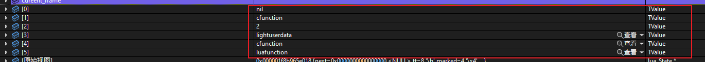
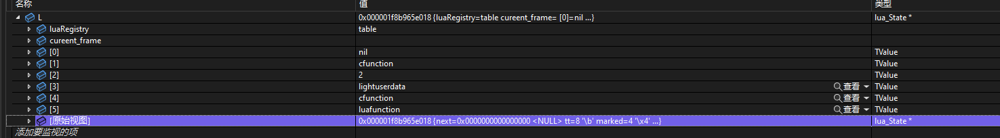
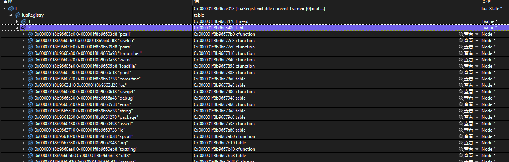
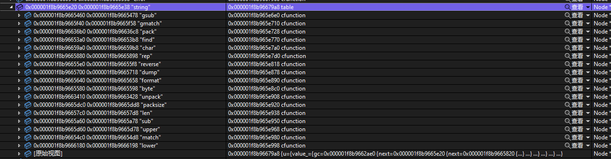
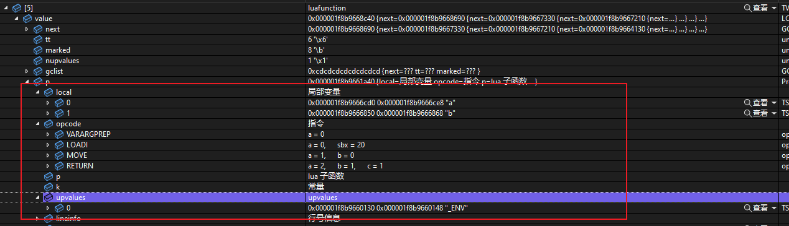

## 在vs中显示lua结构
natvis文件编写  [创建 C++ 对象的自定义视图 - Visual Studio (Windows) | Microsoft Docs](https://docs.microsoft.com/zh-cn/visualstudio/debugger/create-custom-views-of-native-objects?view=vs-2022)

### 1. 基础TValue类型显示

### 2. lua 堆栈显示

只要有lua虚拟机就可以显示当前堆栈

### 3. 全局变量显示

### 4. table 显示

### 5. proto显示

